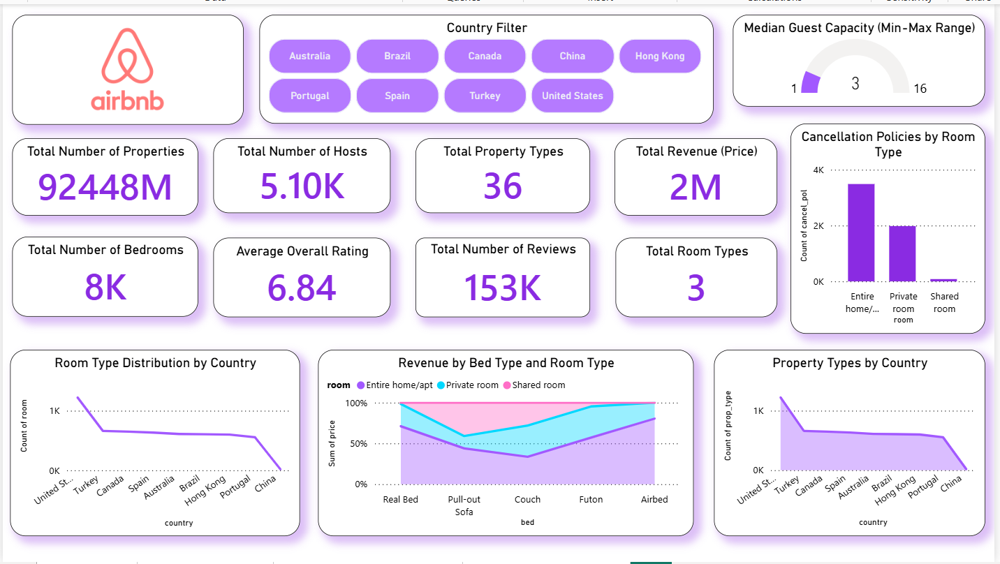
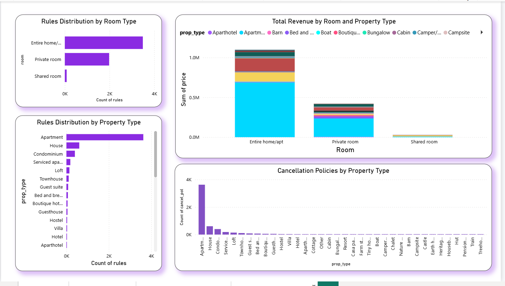
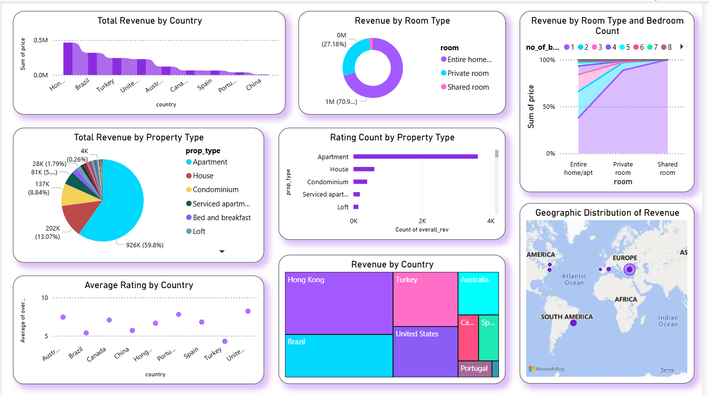

# 🏡 Airbnb Dynamic Pricing Recommendation Engine

Welcome to the Airbnb Dynamic Pricing project! This repository contains code, data, and visualizations used to build a machine learning-based pricing recommendation engine.

---

## 📚 Project Objective

- Predict optimal Airbnb listing prices based on city, room type, reviews, and amenities.
- Analyze historical Airbnb data to uncover pricing patterns.
- Create an interactive dashboard for price suggestions.

---

## 🧰 Tools & Technologies

- **[Python](https://www.python.org/downloads/)** – Core programming language
- **[Pandas](https://pandas.pydata.org/)** – Data manipulation and preprocessing
- **[Scikit-learn](https://scikit-learn.org/stable/)** – Machine learning models and evaluation
- **[XGBoost](https://xgboost.readthedocs.io/)** – Gradient boosting regression
- **[Seaborn](https://seaborn.pydata.org/)** – Data visualization
- **[Excel](https://www.microsoft.com/en-us/microsoft-365/excel)** – Preprocessing and cleaning
- **[Power BI](https://powerbi.microsoft.com/desktop/)** – Interactive dashboard design
- **[Google Colab](https://colab.research.google.com/)** – Cloud-based notebook execution
- **[Microsoft Word](https://www.microsoft.com/en-us/microsoft-365/word)** / PDF – Reporting and documentation

---

## 📋 Dataset

- 📂 Dataset Source: [Airbnb Price Dataset on Kaggle](https://www.kaggle.com/datasets/rupindersinghrana/airbnb-price-dataset)

---

## 📋 Steps Followed

1. **Data Cleaning**  
   - Handled missing values, removed incomplete rows
   
2. **EDA (Exploratory Data Analysis)**  
   - Identified trends across city, review scores, amenities

3. **Feature Engineering**  
   - Encoded categorical variables, transformed text features

4. **Modeling**  
   - Trained and evaluated Linear Regression, Random Forest, XGBoost

5. **Model Evaluation**
   - Used MAE, RMSE, and R² metrics for performance

---

## 🔍 Model Performance

| Model              | MAE    | RMSE   | R²     |
|-------------------|--------|--------|--------|
| XGBoost Regressor | 0.2804 | 0.3869 | 0.71   |
| Random Forest      | 0.2819 | 0.3915 | 0.70   |
| Linear Regression  | 0.3597 | 0.4830 | 0.54   |

---

## 📊 Dashboard

- Built using Power BI (file: `Airbnb.pbix`)
- Includes filters for city, room type, and review score
- Interactive slider for price suggestions


### 🖼️ Dashboard Preview

**Global Overview** 



**Location and Category**  



**Revenue & Rating Insights**  




---

## 📄 Reports

- `Airbnb.ipynb` – Model development notebook  
- `Airbnb.pbix` – Interactive Power BI dashboard 
- `Airbnb_Dynamic_Pricing_Report.pdf`- Full project explanation
- `Recommendations.pdf`- Actionable insights for Airbnb hosts

---

## 🧠 Key Insights

- Entire homes priced 40–70% higher than shared/private rooms
- Listings in NYC and SF had the highest base prices
- High review scores correlate with higher pricing power
- Amenities like Wi-Fi and AC positively affect pricing

---

## 🖥️ How to Run the Project

1. Clone the Repository:
   ```bash
   git clone <repository_link>
   ```
2. Navigate into the project directory:
   ```bash
   cd Final_Project/Airbnb_Dynamic_Pricing
   ```
3. Install the required libraries:
   ```bash
   pip install pandas matplotlib seaborn scikit-learn xgboost
   ```
4. Run the Jupyter notebook:
   - Open `Airbnb.ipynb` in Jupyter or Google Colab

5. View the Power BI dashboard:
   - Open `Airbnb.pbix` with Power BI Desktop

6. Read the reports:
   - View `Airbnb_Dynamic_Pricing_Report.pdf` and `Recommendations.pdf`

---

