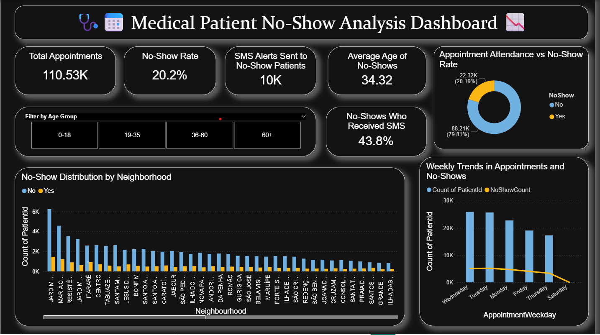
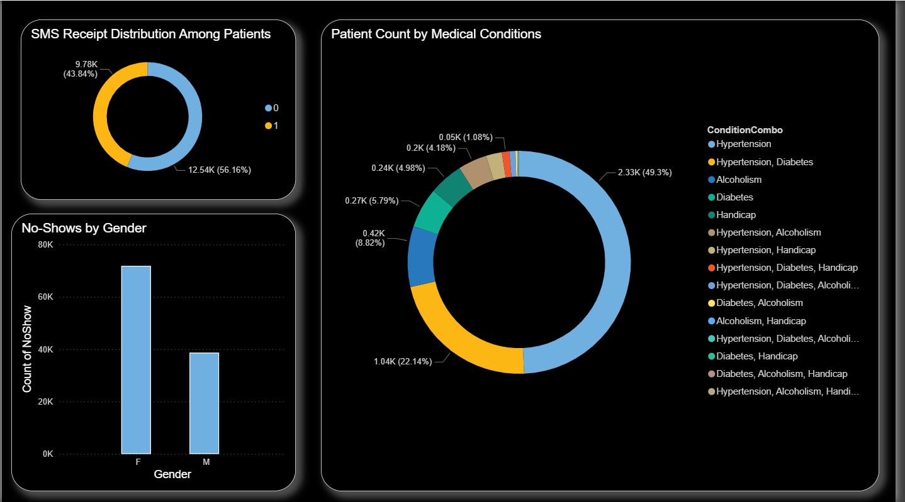
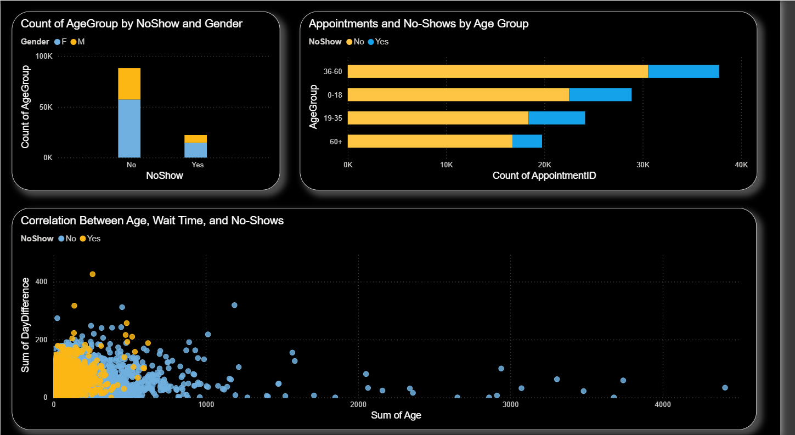
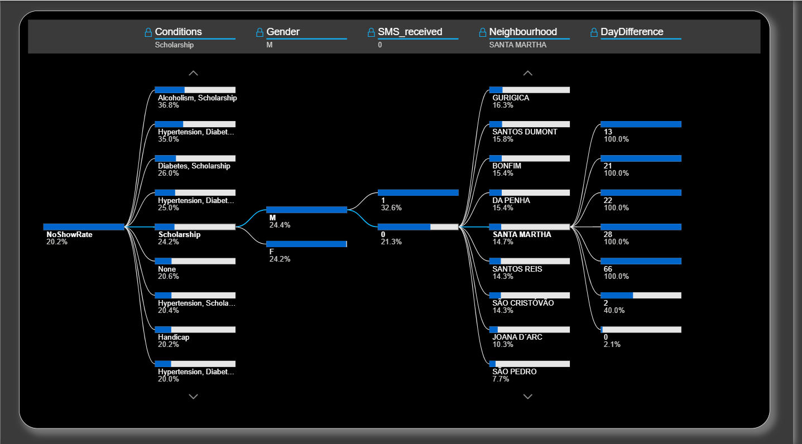

# 🏥 Healthcare Appointment No-Show Prediction

This project uses machine learning and Power BI to predict whether a patient will miss a scheduled medical appointment and provides strategic recommendations to reduce no-show rates.

---

## 📚 Project Objective

- Predict whether a patient will miss their scheduled medical appointment.
- Analyze historical appointment data to discover trends in no-show behavior.
- Create a Power BI dashboard to visualize patterns and support decision-making.
- Recommend strategies to improve attendance and optimize scheduling.
  
---

## 🧰 Tools & Technologies

- **[Python](https://www.python.org/downloads/)** – Core programming language
- **[Pandas](https://pandas.pydata.org/)** – Data preprocessing and manipulation
- **[Scikit-learn](https://scikit-learn.org/stable/)** – ML models and evaluation
- **[XGBoost](https://xgboost.readthedocs.io/)** – Gradient boosting classifier
- **[Seaborn](https://seaborn.pydata.org/)** – Visual exploration and trends
- **[Power BI](https://powerbi.microsoft.com/desktop/)** – Interactive dashboards
- **[Google Colab](https://colab.research.google.com/)** – Notebook execution
- **[Microsoft Word](https://www.microsoft.com/en-us/microsoft-365/word)** / PDF – Final reporting

---

## 📋 Steps Followed

1. **Data Cleaning** – Handled date parsing, removed invalid ages, encoded categories  
2. **EDA** – Analyzed trends like SMS reminders, weekdays, and waiting time  
3. **Feature Engineering** – Added new columns like `waiting_days`, `appointment_day_of_week`  
4. **Modeling** – Trained Decision Tree, Random Forest, and XGBoost models  
5. **Evaluation** – Compared models using Accuracy and F1 Score  
6. **Visualization** – Designed a Power BI dashboard to show insights  

---

## 🔍 Model Performance

| Model              | Accuracy | F1 Score |
|-------------------|----------|----------|
| Decision Tree      | 60.53%   | ~0.61    |
| XGBoost            | 83.48%   | ~0.83    |
| Random Forest      | 84.68%   | ~0.85    |

---

## 📊 Dashboard

- Built in Power BI (`Medical.pbix`)
- Visuals include:
  - No-show by weekday, age, gender
  - Impact of SMS reminders
  - Correlation with waiting time and chronic conditions


### 🖼️ Dashboard Preview

**Overview Dashboard**
  

**Patient Demographics**
  

**Age-wise No Show Analysis**
  

**No Show Rate**
  

---

## 💡 Key Insights

- Higher no-shows observed on Mondays
- SMS reminders significantly increase attendance
- Elderly patients prefer afternoon appointments
- Prior no-show history is a strong predictor
- Long waiting days negatively impact attendance

---

## ✅ Recommendations

- Send SMS reminders 24–48 hours in advance
- Avoid scheduling high-risk patients on Mondays
- Use follow-up calls for patients with no-show history
- Prioritize elderly for late-day slots
- Explore telehealth options for distant neighborhoods

---

## 🖥️ How to Run the Project

1. Clone the Repository:
   ```bash
   git clone <repository_link>
   ```
2. . Navigate into the project directory:
   ```bash
   cd Final_Project/Healthcare_Appointment_No_Show_Prediction
   ```
3. Install the required libraries:
   ```bash
   pip install pandas matplotlib seaborn scikit-learn xgboost
   ```
4. Run the Jupyter notebook:
   - Open `Medical_Appointment.ipynb` in Jupyter or Google Colab

5. View the Power BI dashboard:
   - Open `Medical.pbix` with Power BI Desktop

6. Read the reports:
   - View `Medical_Appointment_Report.pdf` and `Recommendations.pdf`

---
## 📄 Project Files

- `Medical_Appointment.ipynb` – Model development notebook  
- `Medical.pbix` – Interactive Power BI dashboard  
- `Medical_Appointment_Report.pdf` – Full project report  
- `Recommendations.pdf` – Strategic suggestions  

---
